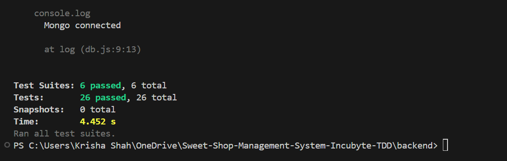

# Sweet Shop Management System

## 📌 Overview

A full-stack inventory management system to manage and track sweet stock in real time. Built with modular architecture, responsive frontend, robust backend, and test-driven development.

---
### 🎥 Demo Video

👉 [Watch the demo on YouTube](https://youtu.be/HSJhINojRHQ)

## ✅ Test Results

All backend test suites passed successfully using **Jest** and **Supertest**:



---


## 🔧 Tech Stack

| Layer    | Tools & Libraries                                        |
| -------- | -------------------------------------------------------- |
| Frontend | React, Tailwind CSS, Lucide Icons, Axios, React Toastify |
| Backend  | Node.js, Express, MongoDB (Mongoose), dotenv             |
| Testing  | Jest, Supertest (MongoDB test instance)                  |
| DevTools | GitHub, VSCode, `npm`, Postman                           |

---

## 📦 Features

### ✅ Backend

* Create, delete, restock, and purchase sweets
* Search sweets by name (case-insensitive)
* Sort by price or quantity
* Robust validation (schema-enforced via Mongoose)
* TDD-tested routes with clear error handling

### 🖼️ Frontend

* Responsive dashboard with Tailwind
* Sweet listing via `SweetCard`
* Add new sweet via `AddSweetForm`
* Real-time actions: Purchase, Restock, Delete
* Toast alerts for feedback

---

## 🚀 How to Run

### ✅ Clone & Install

```bash
git clone https://github.com/krishashah-03/Sweet-Shop-Management-System-Incubyte-TDD.git
cd Sweet-Shop-Management-System-Incubyte-TDD
npm install
```

### 📂 Backend Setup

```bash
cd backend
touch .env
```

Add to `.env`:

```env
MONGO_URI=your-mongodb-connection-string
PORT=8080
```

Run server:

```bash
npm start
```

### 📦 Frontend Setup

```bash
cd frontend
npm install
npm run dev
```

Frontend: `http://localhost:5173`
Backend: `http://localhost:8080`

---

## 🧪 Running Tests

Run all backend tests:

```bash
npm test
```

### ✅ Test Coverage

| Test File            | Coverage Description                             |
| -------------------- | ------------------------------------------------ |
| `validation.test.js` | Field requirements, type checks, duplication     |
| `api.test.js`        | Invalid routes, 404s, server errors              |
| `inventory.test.js`  | Purchase & restock logic                         |
| `search.test.js`     | Name-based searching (partial, case-insensitive) |
| `sort.test.js`       | Sorting by price and quantity                    |
| `sweets.test.js`     | Core sweet operations (add/delete)               |

---

## 📄 Folder Structure

```bash
frontend/
  ├── components/
  │   ├── AddSweetForm.jsx
  │   ├── FilterSortBar.jsx
  │   └── SweetCard.jsx
  ├── pages/
  │   └── Home.jsx
  └── services/api.js

backend/
  ├── models/Sweet.js
  ├── controllers/sweetController.js
  ├── routes/sweetRoutes.js
  ├── tests/
  │   ├── validation.test.js
  │   ├── api.test.js
  │   ├── inventory.test.js
  │   ├── search.test.js
  │   ├── sort.test.js
  │   └── sweets.test.js
  ├── app.js
  └── db.js
```

---

## 🙌 Credits

Built by **Krisha Shah**

---

